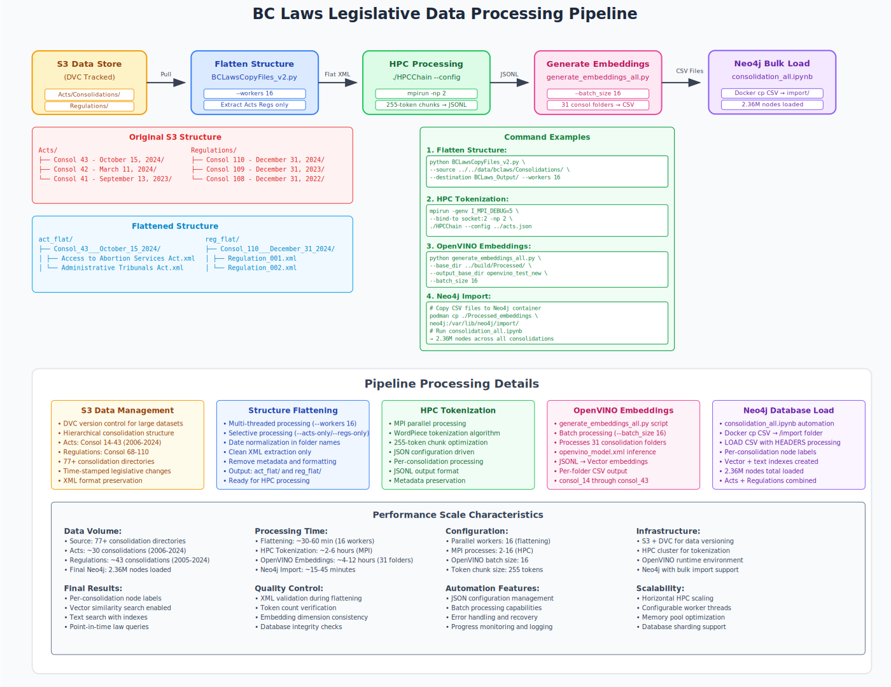

# End-to-End Legislative Data Processing Pipeline

## 1. Overview

This document outlines the complete data pipeline for processing raw, point-in-time legislative documents (Acts and Regulations) into a structured, analysis-ready format. The workflow is designed to handle a large corpus of XML data, process it efficiently using a High-Performance Computing (HPC) application, generate semantic embeddings with OpenVINO™, and prepare the final data for bulk ingestion into a Neo4j graph database.

The entire data source is version-controlled using DVC and stored in S3, ensuring reproducibility.

The pipeline consists of four primary stages:
1.  **Data Preparation:** Flattening the complex source directory structure.
2.  **HPC Processing:** Tokenizing and chunking the text content at scale.
3.  **Embedding Generation:** Creating vector embeddings from the tokenized data.
4.  **Graph Ingestion:** Bulk-loading the processed data into Neo4j.



## 2. Stage 1: Data Preparation - Flattening the Directory Structure

The raw data is organized into a series of "consolidation" folders, each representing a specific point in time for the legislation. This nested structure is not ideal for parallel processing. The first step is to flatten it.

### a. Source Structure

The initial data structure is nested, with consolidations located under `Acts/` and `Regulations/` directories:

```
.
├── Acts
│   ├── Consol 14 - February 13, 2006
│   ├── Consol 15 - July 11, 2006
│   └── ... (and so on)
└── Regulations
    ├── Consol 68 - December 9, 2005
    └── ... (and so on)
```

### b. The Flattening Script

We use the `BCLawsCopyFiles_v2.py` script to transform this structure. This script walks the source directories, cleans the folder names, and copies the relevant XML files into a new, flat output structure.

**Script Usage:**

```
usage: BCLawsCopyFiles_v2.py [-h] --source SOURCE --destination DESTINATION [--consolidation CONSOLIDATION] [--acts-only] [--regs-only] [--workers WORKERS]
```

### c. Execution Command

To process all consolidations using 16 parallel workers, run the following command:

```bash
python BCLawsCopyFiles_v2.py \
    --source ../../data/bclaws/Consolidations/ \
    --destination BCLaws_flast_test/ \
    --workers 16
```

### d. Flattened Output Structure

The script produces a clean, two-folder structure (`act_flat/` and `reg_flat/`), where each sub-folder contains only the clean XML files for that consolidation. This structure is now ready for the HPC application.

## 3. Stage 2: HPC Tokenization and Chunking

This is the core processing stage where the flattened XML files are parsed, tokenized, and chunked using our C-based HPC application.

### a. The HPC Application

The `HPCChain` executable is designed to be launched with MPI (`mpirun`) for distributed processing. It can take input paths directly or, more conveniently, use a JSON configuration file.

**Application Usage:**

```
Usage:
  ./HPCChain <token_file> <act_path_1> <act_path_2> <print_flag>
  or
  ./HPCChain --config <config_file.json>
```

### b. Configuration File

We use a JSON file (e.g., `acts.json`) to define the list of consolidation folders to process. This provides better control and organization.

### c. Execution Command

The application is launched using `mpirun` to distribute the workload across CPU sockets.

```bash
mpirun -genv I_MPI_DEBUG=5 --bind-to socket:2 -np 2 ./HPCChain --config ../acts.json
```

### d. Output: Tokenized `jsonl` Files

The `HPCChain` application processes all the XML files and outputs `jsonl` files. Each line in these files is a JSON object containing a 255-token chunk of text and rich metadata.

**Example `jsonl` line:**

```json
{"chunk_seq_id":1, "act_id":"Municipalities Enabling and Validating Act (No. 3)", "reg_title":"", "section_number":"1", "section_title":"Definitions", "url":"...", "source_rank":1, "tokens":[101, 1999, 2054, ...], "token_chunk":[101, 1999, ...], "chunk_text":"in this section authorized borrowing means amounts that ,  before this section comes into force ,  have been authorized to be borrowed by bylaw under section 561  ( 5 )  or  ( 6 )  of the municipalities enabling and validating act  ( no .  3 )  ,  s . b . c .  1998 ,  c .  31 ,  or have been authorized to be borrowed by loan authorization bylaw under section 561  ( 1 )  or  ( 4 )  of the municipalities enabling and validating act  ( no .  3 )  ;  naramata service area means the service area described in the regional district bylaw cited as  naramata water system local service establishment bylaw no .  1898 ,  1995  ,  as originally adopted ;  naramata special debt financing service means a service of the regional district under part 24 of the local government act that is established to recover the costs of authorized borrowing ,  and for which the service area is the naramata service area ;  parcel tax means a parcel tax referred to in subsection  ( 4 )  ;  regional district means the regional district of okanagan - similkameen .  2 if the regional district proposes to establish a naramata special debt financing service ,  a despite section 800 . 1  ( e )  of the local government"}
```

## 4. Stage 3: Generating Embeddings with OpenVINO™

In this stage, we use a Python script to generate vector embeddings from the tokenized `jsonl` files using a pre-trained OpenVINO™ model.

### a. The Embedding Script

The `generate_embeddings_all.py` script is designed to iterate through the processed folders and run inference on the token chunks.

**Script Usage:**

```
usage: generate_embeddings_all.py [-h] --base_dir BASE_DIR --output_base_dir OUTPUT_BASE_DIR [--model_path MODEL_PATH] ...
```

### b. Execution Command

This command processes all `consol_*` folders in the `Processed/` directory, using a batch size of 16 for inference.

```bash
python generate_embeddings_all.py \
    --base_dir ../build/Processed/ \
    --output_base_dir openvino_test_new \
    --batch_size 16
```

### c. Output: Embedding CSV Files

The output of this stage is a set of CSV files structured specifically for the Neo4j bulk importer. Each row represents a text chunk and its corresponding vector embedding.

**CSV Schema:**
`act_id, year_enacted, reg_title, section_number, section_title, section_url, url, source_rank, chunk_text, source_file, embedding`

## 5. Stage 4: Neo4j Bulk Ingestion & Graph Modeling

The final stage involves loading the generated CSV files into Neo4j and modeling the data as a point-in-time graph.

### a. Data Modeling in Neo4j

Each consolidation snapshot is loaded into the graph with its own unique label. This creates a distinct subgraph for each point in time, allowing for precise historical analysis.

**Labeling Strategy:**

* Acts from consolidation 42 are labeled `:consolidation_42_act`.
* Regulations from consolidation 109 are labeled `:consolidation_109_reg`.

This results in a rich graph containing nodes for each consolidation, as well as general nodes like `:Act`, `:Chunk`, `:Section`, etc.

### b. The Ingestion Script

A Jupyter Notebook (`consolidation_all.ipynb`) automates the loading process. It connects to the Neo4j instance and performs the following steps for each consolidation folder:

1.  **Clears old data:** Deletes any existing nodes with the same consolidation label to ensure a clean import.
2.  **Loads CSVs:** Uses `LOAD CSV` Cypher queries to ingest the data from each CSV file.
3.  **Creates Indexes:** After loading, it creates two types of indexes on the new nodes:
    * **Vector Index:** For efficient semantic similarity searches on the `embedding` property.
    * **Text Index:** On properties like `title` for fast keyword searches.

### c. Preparing for Import

Before running the notebook, the CSV files must be accessible to the Neo4j database. This is typically done by copying them into the container's `import` directory.

**Example Docker command:**

```bash
podman cp ./Processed_embeddings neo4j:/var/lib/neo4j/import/
```

### d. Final Result

The result is a powerful graph database where each legislative snapshot is preserved. This enables complex queries that can compare laws over time, perform semantic searches on legal text, and analyze the evolution of regulations.
