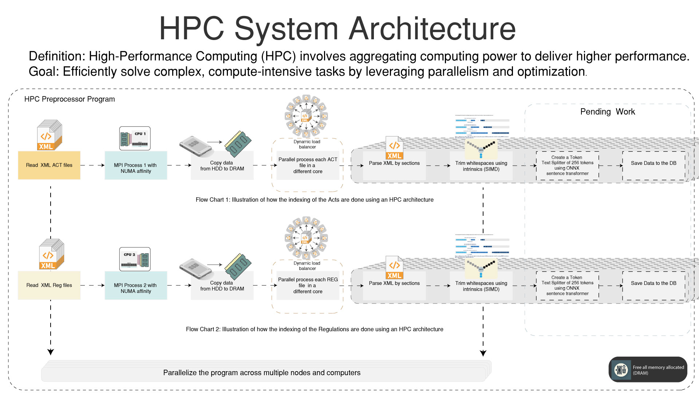
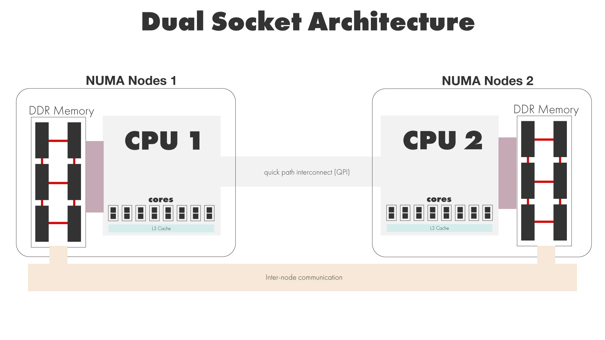
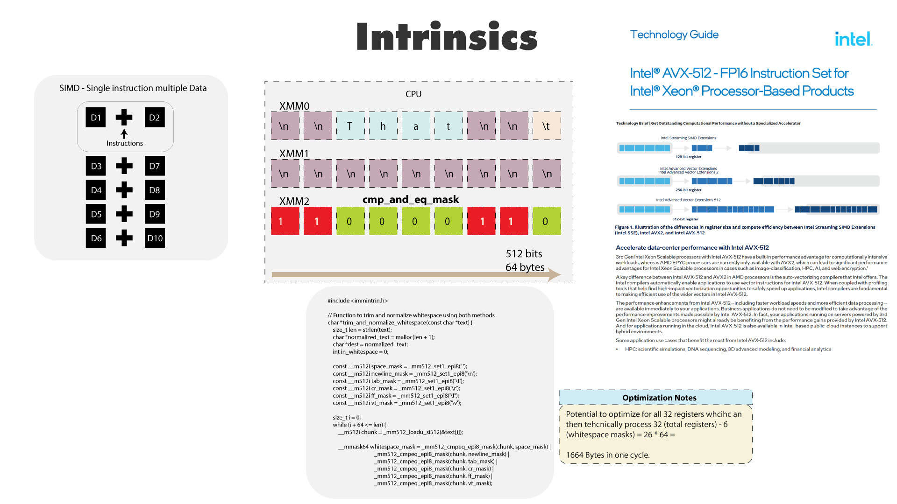
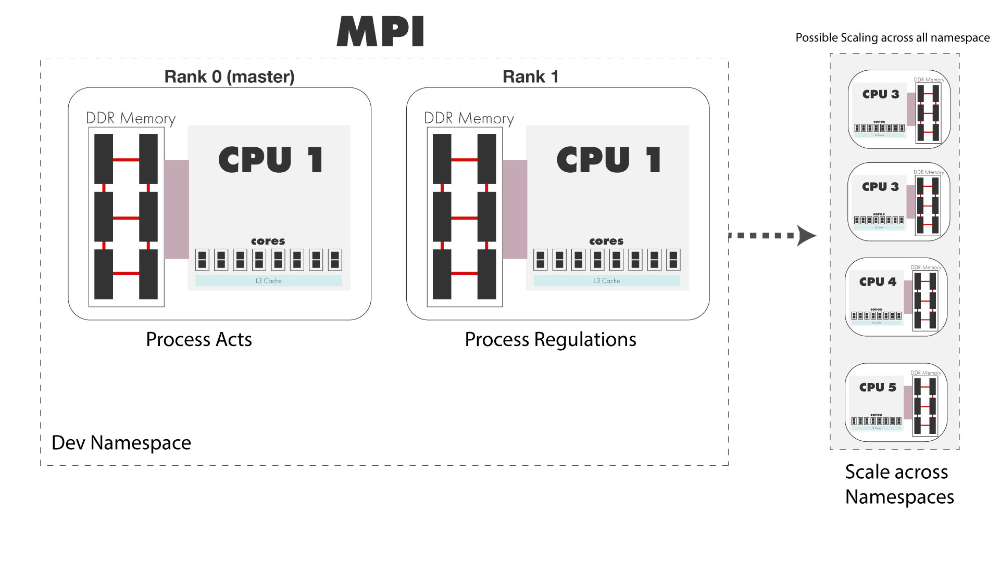
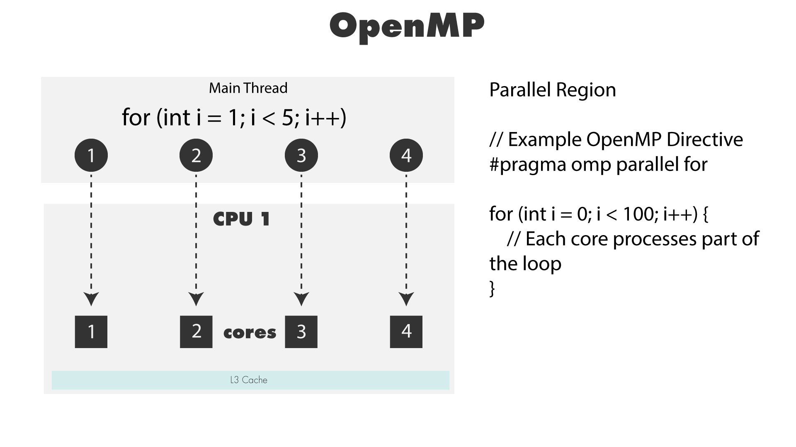

# High Performance Computing to generate embeddings

## Introduction - Why HPC
When generating embeddings for large datasets like B.C acts and regulations, running the embeddings on a Core-i7, on a docker container on a laptop is not feasible. The whole process can take upto 10 days rendering the laptop unusable for any other tasks. 

Using the cloud compute resources avaiable in B.C Gov, by using some of the open source frameworks we can generate the embeddings in a fraction of the time. But it still takes a few hours to generate the embeddings.

This brings us to writing custom code to take advantage of the hardware to generate the embeddings faster.

Using and writing a custom C code that is designed with HPC in mind we may be able to generate the embeddings in a fraction of the time it takes to generate the embeddings using the open source frameworks.  

# How it works:
This architecture efficiently handles large volumes of data by leveraging the power of HPC. By using parallel processing techniques and optimizing memory usage, the system can process and index XML ACT and REG files swiftly. The dynamic load balancer ensures that the processing load is evenly distributed across multiple cores, preventing any single core from becoming a bottleneck. The use of SIMD intrinsics and ONNX sentence transformers further enhances the efficiency of data processing and indexing.

Overall, this architecture is designed to handle complex, compute-intensive tasks effectively, making it suitable for applications requiring high-performance data processing and indexing.

# HPC System Architecture Overview

The provided image illustrates the HPC (High-Performance Computing) system architecture designed to efficiently handle the indexing of XML ACT and REG files using parallel processing and optimization techniques. Here’s a detailed breakdown and explanation of each step involved in the process:

## Definition and Goal
- **Definition**: High-Performance Computing (HPC) involves aggregating computing power to deliver higher performance.
- **Goal**: Efficiently solve complex, compute-intensive tasks by leveraging parallelism and optimization.

## Flow Chart 1: Indexing of ACT Files
1. **Read XML ACT Files**:
   - **Task**: Load XML ACT files from the source.
   - **Purpose**: Prepare the data for processing and indexing.

2. **MPI Process 1 with NUMA Affinity**:
   - **Task**: Use Message Passing Interface (MPI) to assign the task to a specific CPU with Non-Uniform Memory Access (NUMA) affinity.
   - **Purpose**: Optimize memory access and CPU utilization.

3. **Copy Data from HDD to DRAM**:
   - **Task**: Transfer data from Hard Disk Drive (HDD) to Dynamic Random Access Memory (DRAM).
   - **Purpose**: Ensure faster data access and processing.

4. **Dynamic Load Balancer**:
   - **Task**: Distribute the processing load across multiple cores.
   - **Purpose**: Achieve efficient parallel processing.

5. **Parallel Processing of ACT Files**:
   - **Task**: Each ACT file is processed in a different core.
   - **Purpose**: Enhance processing speed and efficiency through parallelism.

6. **Parse XML by Sections**:
   - **Task**: Break down the XML file into manageable sections for parsing.
   - **Purpose**: Simplify and speed up the parsing process.

7. **Trim Whitespaces Using Intrinsics (SIMD)**:
   - **Task**: Use Single Instruction, Multiple Data (SIMD) intrinsics to remove unnecessary whitespaces.
   - **Purpose**: Optimize data size and improve processing efficiency.

8. **Create a Token Text Splitter of 256 Tokens Using ONNX Sentence Transformer**:
   - **Task**: Tokenize the text into 256-token segments using an ONNX (Open Neural Network Exchange) sentence transformer.
   - **Purpose**: Prepare the text for efficient indexing and retrieval.

9. **Save Data to the Database**:
   - **Task**: Store the processed and tokenized data in the database.
   - **Purpose**: Ensure data is indexed and ready for retrieval.

## Flow Chart 2: Indexing of REG Files
The process for indexing REG files is identical to that of ACT files, with the following steps:
1. **Read XML REG Files**.
2. **MPI Process 2 with NUMA Affinity**.
3. **Copy Data from HDD to DRAM**.
4. **Dynamic Load Balancer**.
5. **Parallel Processing of REG Files**.
6. **Parse XML by Sections**.
7. **Trim Whitespaces Using Intrinsics (SIMD)**.
8. **Create a Token Text Splitter of 256 Tokens Using ONNX Sentence Transformer**.
9. **Save Data to the Database**.

## Additional Notes
- **Pending Work**: Some parts of the process are marked as pending, indicating areas that are still under development or refinement.
- **Freeing Memory**: Once the tasks are completed, all allocated memory in DRAM is freed to ensure efficient use of resources.

The overall time to process this takes a few seconds increase the effiecieny of embeding the data by 1000x.

## Details of eact step in the process

## Dual Socket Architecture

### Description
The dual socket architecture diagram illustrates a system with two CPUs, each connected to its own set of memory modules. This architecture is designed to optimize performance by providing dedicated resources to each CPU while allowing communication between them.

### Components
1. **NUMA Nodes**: 
   - **NUMA Node 1**: Contains CPU 1 and its dedicated DDR memory.
   - **NUMA Node 2**: Contains CPU 2 and its dedicated DDR memory.

2. **CPUs**:
   - **CPU 1 and CPU 2**: Each CPU has its own cores and L3 cache, allowing them to handle tasks independently.

3. **Memory**:
   - **DDR Memory**: Each CPU is connected to its own DDR memory, optimizing memory access speed and reducing latency.

4. **Interconnect**:
   - **Quick Path Interconnect (QPI)**: Facilitates communication between the two CPUs, enabling data transfer and synchronization.

## Intrinsics

### Description
The intrinsics diagram explains the use of SIMD (Single Instruction Multiple Data) instructions to perform operations on multiple data points simultaneously. It highlights the use of AVX-512 instructions on Intel Xeon processors to optimize performance.

### Components
1. **SIMD**:
   - **Instructions**: SIMD allows a single instruction to process multiple data points, improving computational efficiency.

2. **Registers**:
   - **XMM0, XMM1, XMM2**: These are 512-bit registers used to store data for SIMD operations.
   - **cmp_and_eq_mask**: A mask used for comparison operations.

3. **Example Code**:
   - **Code Snippet**: Shows how to trim and normalize whitespace using SIMD instructions in C.

4. **Optimization Notes**:
   - **Potential Optimization**: Highlights the potential to process 1664 bytes in one cycle using AVX-512.

## MPI (Message Passing Interface)

### Description
The MPI diagram showcases how the system processes ACT and REG files using multiple CPUs. Each CPU processes different parts of the data in parallel, and the system can scale across namespaces for greater efficiency.

### Components
1. **Ranks**:
   - **Rank 0 (Master)**: Manages the processing of ACT files.
   - **Rank 1**: Manages the processing of REG files.

2. **CPUs**:
   - **CPU 1**: Used for processing within each rank.
   - **Scaling**: Indicates potential scaling across namespaces with additional CPUs.

## OpenMP (Open Multi-Processing)

### Description
The OpenMP diagram illustrates how parallel processing is achieved by distributing tasks across multiple cores within a CPU. OpenMP directives are used to specify parallel regions in the code.

### Components
1. **Main Thread**:
   - **Loop Parallelization**: An example loop that is parallelized using OpenMP.

2. **Parallel Region**:
   - **Cores**: Tasks are distributed across different cores, each processing part of the loop.

### Summary
These diagrams illustrate different aspects of the HPC system architecture, including dual socket configurations, SIMD intrinsics, MPI usage, and OpenMP parallel processing. Each component is optimized to handle specific tasks, improving overall performance and efficiency in data processing and computational tasks.

