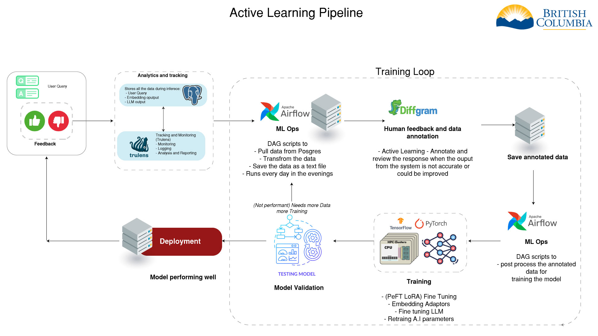

# Active Learning Pipeline

## Overview
To make the A.I perform better and more accurately when it does not repond correctly or where the response could be improved, we use active learning. 

Active learning is the process of automatically capturing the feedback from the users and use that feedback to improve the models performance. 

As opensource A.I is trained on a large corpus of data, it is not perfect and can make mistakes. There may be biases inbuilt in the model or the model may not have seen enough data to make an accurate prediction. This can result in giving wrong information or hallucinating.

To prevent this, we use active learning to continuously improve the model's performance by capturing the user feedback and interactions and using that feedback to retrain the model. This iterative process ensures that the model learns from its mistakes and adapts to provide more accurate and relevant responses to user queries.

To get this working in an automated way, we use the following components:

## Key Components and Workflow
- Data capturing by Trulens
- Data processing by Apache Airflow
- Data annotation by our custom U.I and or diffgram
- Anootated data storage in S3
- Data preparation for A.I training by Apache Airflow
- A.I training using Pytorch or Tensorflow using a linear model or a transformer model
- Contiue the loop by capturing more data and repeating the process
- Once nmodel is performing well, deploy it to production

### Data Capturing
- **Trulens**
  - Trulens is a tool that captures the user interactions with the A.I model. It captures the user feedback and the context in which the feedback was given. This data is then used to improve the model.

### Data Processing
- **Apache Airflow (MLOps & ETL Pipelines)**
  - **Data Preparation**
    - The raw data captured by Trulens is processed and cleaned to ensure consistency and quality. To increase the the data size and diversity, additional data augmentation techniques are applied. 
    for e.g. query expansion, data synthesis, auto labelling by using the model's predictions.
  - **Data Annotation**
    - The processed data is annotated by the users using our custom dashboard or by using diffgram to create labeled data for training the A.I model.
  - **Data Storage**
    - The annotated data is stored in S3 for easy access and retrieval during the training process.

### Data Preparation
- **Apache Airflow (MLOps & ETL Pipelines)**
  - **Data Preprocessing**
    - The annotated data is preprocessed to convert it into a format suitable for training the A.I model.
  - **Data Augmentation**
    - Additional data augmentation techniques are applied to increase the diversity and size of the training data. This helps improve the model's generalization and performance.
    for e.g. 
  - **Data Splitting**
    - The data is split into training, validation, and test sets to evaluate the model's performance.

### A.I Training
- **Pytorch or Tensorflow**
  - **Model Training**
    - The preprocessed data is used to train the A.I model, either a linear model or a transformer model, depending on the task and complexity.
  - **Model Evaluation**
    - The trained model is evaluated on the validation set to measure its performance and identify areas for improvement.
  - **Model Tuning**
    - The model hyperparameters are tuned based on the evaluation results to optimize performance further.

### Continuous Loop
- **Data Capturing**
  - The A.I model is deployed in a production environment, and Trulens continues to capture user interactions and feedback.
  The above process is repeated iteratively to improve the model's performance continuously.

### Deployment
- **Production Deployment**
  - Once the model reaches a satisfactory performance level, it is deployed in a production environment to provide real-time responses to user queries.

This active learning pipeline ensures that the A.I model is continuously improved based on user feedback and interactions, leading to better accuracy and performance over time.

### Conclusion
By using active learning techniques and a well-defined pipeline, we can enhance the A.I model's performance and accuracy by leveraging user feedback and interactions. This iterative process of capturing, processing, annotating, and training data ensures that the model continuously learns and adapts to provide more accurate and relevant responses to user queries. 

This will prevent the A.I from hallucinating and making mistakes. A.I safety is a key concern and active learning is a way to ensure that the A.I is safe and reliable.

 The active learning pipeline is a key component in the development and deployment of A.I systems that require continuous improvement and optimization based on user feedback and real-world interactions.
