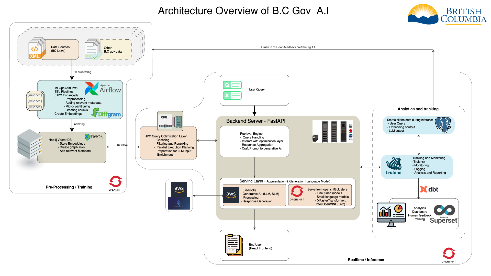

# A.I Architecture Overview

## RAG System Architecture Overview

The architecture of our Retrieval-Augmented Generation (RAG) system is designed to efficiently handle user queries by integrating multiple technologies for data retrieval, processing, and response generation. The system leverages FastAPI for the backend, Amazon Bedrock for the LLM (Large Language Model) services, Apache Airflow for MLOps (ETL processes), TruLens for feedback and monitoring, and a frontend built with JavaScript and React.

### Architecture Components

1. **Data Sources**:
   - **Description**: Currently our A.I system is using BC Laws as the data source. 
   - **Role**: Provides raw data that is ingested and processed by the system. All data is currently stored in S3 buckets.

2. **ETL Pipelines (Apache Airflow)**: (In development)
   - **Description**: Managed by Apache Airflow to handle Extract, Transform, and Load (ETL) processes.
   - **Role**: Cleans, transforms, and loads data into the system, ensuring it is ready for querying and retrieval.
   - **Note**: We are still in the process of setting up the ETL pipelines for the BC Laws data. Some of the ETL process will leverage HPC for faster processing.

3. **Backend (FastAPI)**:
   - **Description**: Serves as the core backend framework.
   - **Role**: Handles incoming API requests, orchestrates data retrieval, and interacts with other components like the LLM and the database.

4. **Database (Neo4j Vector DB)**:
   - **Description**: Stores vectorized data representations for efficient querying.
   - **Role**: Provides fast access to data based on vector similarity searches.

5. **Query Optimization and Retrieval**: (Future Development)
   - **Description**: An intermediate layer that processes and optimizes queries before they reach the database.
   - **Role**: Ensures efficient query execution, reducing latency and improving response times.
   - **Note**: This layer is currently still under development. This will include a process called query expansion where the user query is expanded to include more relevant terms. These terms are then used to retrieve more relevant data from the database.

6. **Post-retrieval Processing Layer**:
   - **Description**: Refines and enhances the data retrieved from the database.
   - **Role**: Performs data cleaning, transformation, aggregation, and prepares the data for LLM input.
    - **Note**: This layer is responsible for ensuring that the data is in the correct format and structure for the LLM to generate responses. This can include the rerank, prompt compression,  generating the prompt, and other preprocessing steps that can help the LLM generate better responses.

7. **Augmentation & Generation (AWS Bedrock)**:
   - **Description**: Utilizes Amazon Bedrock to process the prepared data and generate responses.
   - **Role**: Enhances the retrieved data, generates summaries, and provides detailed and context-aware responses.
   - **Note**: We may plan to use openshift too as our infenrence engine. This will be decided based on the performance of the system, the type of model that can work for our data and hardware and how it will impact the overal quality of the product.

8. **Feedback and Monitoring (TruLens)**:
   - **Description**: Tracks and monitors the entire RAG pipeline.
   - **Role**: Provides real-time monitoring, performance metrics, and feedback to ensure the system operates efficiently and reliably.

9. **Frontend (JavaScript and React)**:
   - **Description**: User interface built with JavaScript and React.
   - **Role**: Interacts with users, sends queries to the backend, and displays the generated responses.

