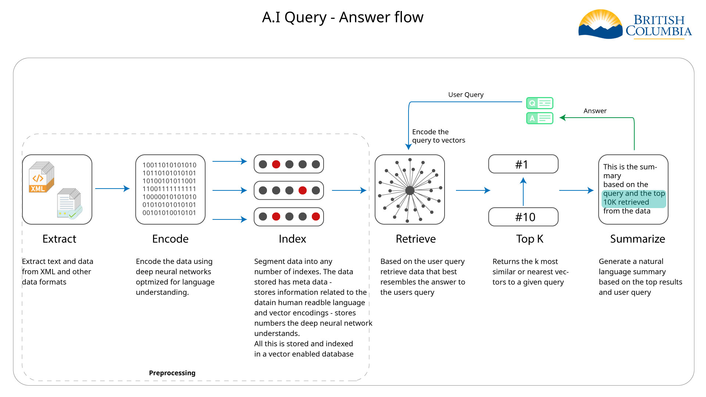

# Architecture

This section provides an overview of the architecture of the AI Query Answering System. The architecture is designed to support the end-to-end flow of the system, from data ingestion to query answering. 

The above diagram illustrates the flow of the AI Query Answering System. The system consists of the following steps:

1. **Data Ingestion**: The system ingests data from various sources, such as databases, files, and APIs. The data is then preprocessed to extract relevant information and convert it into a structured format.

    In the context of B.C laws, the data ingestion process involves extracting information from legal documents, such as statutes, regulations, and case law which are in XML format. The system parses the legal text by sections and converts it into a structured format for further processing.

2. **Data Preprocessing**: The preprocessed data is cleaned, tokenized, and converted into embeddings using language models such as BERT. The embeddings capture the semantic meaning of the text and enable the system to understand the context of the query.

    The data is encodings are then stored in a vector database along with the metadata for efficient retrieval. The vector database allows the system to quickly retrieve relevant documents based on the query. This vector database uses approximate nearest neighbor search algorithms (ANN) or cosine similarity to find the most similar documents.

3. **Query Processing**: When a user submits a query, the system processes the query by converting it into embeddings using the same language model. The query embeddings are then compared with the document embeddings stored in the vector database to find the most relevant documents.

    The system retrieves the top-k documents based on the similarity score and presents them to the user as search results. The user can then explore the documents and find the information they are looking for.

4. **Rerank (optional)**: The system can optionally rerank the search results based on additional features such as user quser query, and the top K result from the initial search. This reranking step can improve the relevance of the search results and provide a better user experience.

5. **Summarize**: Based on a custom prompt with includes the query and the top K results, is fed into an autoregressive (generative A.I) large language model to generate a summary of the top K results. This summary can help the user quickly understand the key points of the documents and make informed decisions.
