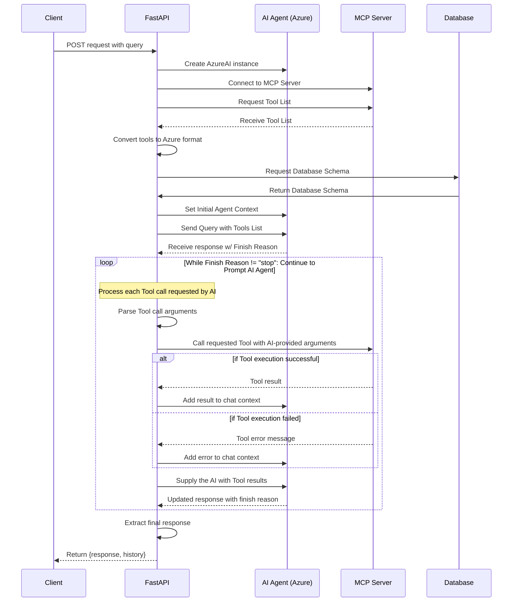

# Agentic Flow

This diagram represents a simplified sequence where an AI Agent can utilize MCP tools at its descretion.

The initial set of tools are obtained from the MCP Server and provided to the AI Agent. The AI Agent can then decide to use one or many of these tools to gain additional context for its final response.

It was used in an initial version of the agentic workflow.

