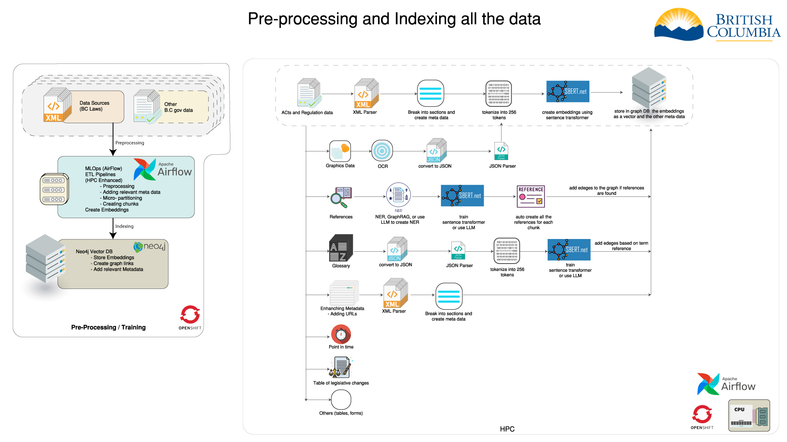

# Preprocessing architecture overview

This document outlines the architecture of the data preprocessing workflow. The laws and regulations data come in various formats and structures. To enrich user queries with the most relevant information, we first need to:

- Segment each act and regulation into individual sections.
- Create references for sections and subsections.
- Index all types of data, including text, graphics, and tables.
- Enhance metadata to improve search and retrieval capabilities.

 

## Overview
The diagram illustrates the process of pre-processing and indexing British Columbia (BC) laws and regulations data, integrating HPC (High-Performance Computing) enhancements with Apache Airflow for workflow orchestration and Neo4j for storing vector embeddings.

## Key Components and Workflow

### Data Sources
- **BC Laws Data (XML)**
  - This includes the legislative texts, acts, and regulations provided in XML format. These files contain structured data representing various legal documents and statutes relevant to British Columbia.

- **Other BC Government Data**
  - Additional data sets from the BC government that may include statistical data, policy documents, and other relevant information that complements the BC Laws Data. This data can come in various formats and provides broader context and connections.

### Pre-processing
- **Apache Airflow (MLOps & ETL Pipelines)**
  - **Preprocessing**
    - Initial cleaning and structuring of the raw data to ensure consistency and quality.
  - **Adding Relevant Metadata**
    - Enriching the data with additional information, such as dates, categories, and identifiers, to provide context and improve searchability.
  - **Micro-partitioning**
    - Dividing the data into smaller, manageable segments to facilitate parallel processing and improve computational efficiency.
  - **Creating Chunks**
    - Segmenting the text into smaller pieces or chunks, making it easier to handle and process, especially for large documents.
  - **Creating Embeddings**
    - Transforming the text chunks into numerical representations (embeddings) using advanced language models. These embeddings capture the semantic meaning of the text, enabling more effective searching and linking.

### Indexing
- **Neo4j Vector DB**
  - **Store Embeddings**
    - Saving the numerical representations of the text in a database optimized for handling vector data, allowing for efficient retrieval and similarity searches.
  - **Create Graph Links**
    - Establishing connections between different pieces of data based on their relationships, such as references or similar topics, creating a rich, interconnected graph of information.
  - **Add Relevant Metadata**
    - Including additional metadata in the graph database to enhance the understanding and utility of the stored embeddings, such as source information, document types, and other contextual details.

This workflow ensures that the BC laws and related data are thoroughly processed, enriched, and indexed, enabling advanced search and retrieval capabilities through the use of HPC, Apache Airflow, and Neo4j technologies.

### Detailed Pre-processing Steps
- **Acts and Regulation Data**
The process involves parsing the XML data, breaking it into sections while creating metadata, tokenizing the text into 256 tokens, creating embeddings using a sentence transformer, and finally storing the embeddings and metadata in a graph database.

 Steps:
  - Parse XML data
  - Break into sections and create metadata
  - Tokenize into 256 tokens
  - Create embeddings using a sentence transformer
  - Store embeddings and metadata in a graph database
- **Graphics Data**
  - Perform OCR
  - Convert to JSON
  - Parse JSON
  - Create embeddings using a sentence transformer
  - Store embeddings and metadata in a graph database
- **Process references**
  - The process of extracting references from the text and creating metadata is a bit complex given our data. The most suitable method is to use NER (Named Entity Recognition) and NLP (Natural Language Processing) techniques to extract references and create metadata.

  extracting NER might involve taking a few sample sections and annotating them manually to train the model. The model can then be used to extract references from the entire dataset. We will be using the sentence transformer model to train the NER model.

### Conclusion
The pre-processing and indexing of BC laws and regulations data involve a series of steps that include parsing XML data, breaking it into sections, creating metadata, tokenizing text, creating embeddings, and storing the embeddings and metadata in a graph database. The process is complex and requires the integration of various tools and techniques to ensure the data is enriched and easily accessible for users. Apache Airflow, Neo4j, and HPC enhancements play a crucial role in orchestrating the workflow and storing the data efficiently. The use of NER and NLP techniques further enhances the metadata and makes the data more searchable and relevant for users.