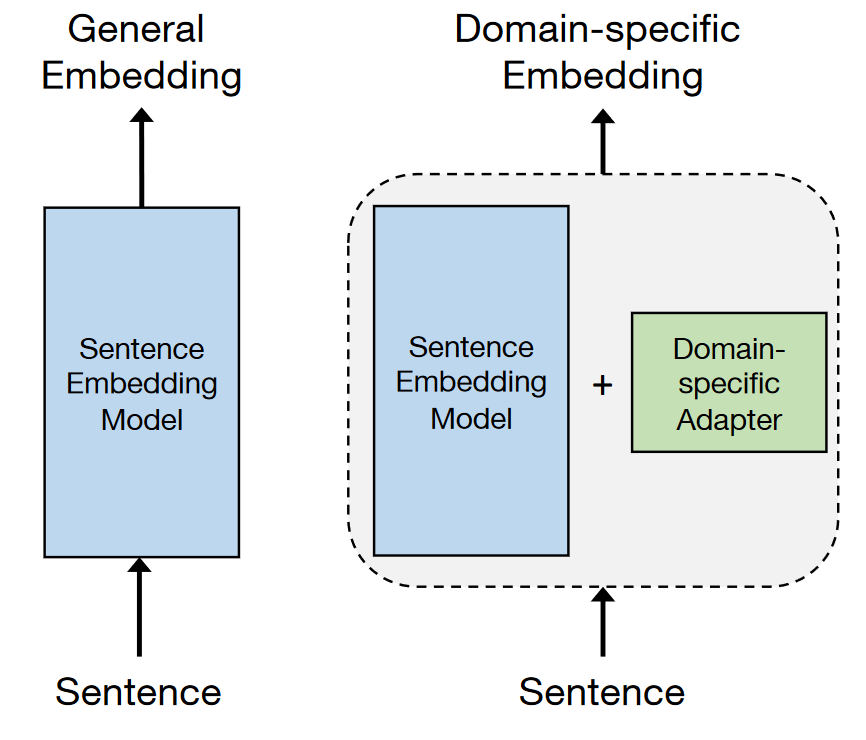

# Feedback application

This folder contains the infrastructure to improve the A.I by using human feedback in the loop. The feedback curretnly uses trulens to collect and store the data. 

## Embedding Adaptors

Source: [Efficient Domain Adaptation of Sentence Embeddings Using Adapters](https://www.catalyzex.com/paper/arxiv:2307.03104)

One of the methods to improve the A.I espeically in a R.A.G application is to use embedding adaptors. Embedding adaptors is a custom neural network that works alogin side the existing model to improve the embedding search. 

To get the embedding adaptors to work, we have created a frontend application to track the queries, the top K results from the semantic search and the feedback from the user. The feedback is then stored in the trulens database.

Once the feedback is collected, we can use the feedback to train the embedding adaptors.

### How does it work?
1. The user enters a query in the search bar
2. The query is sent to the semantic search model
3. The top K results are displayed to the user
4. The user can select the correct result based on thumbs up/down
5. The feedback is stored in the trulens database
6. The feedback is used to train the embedding adaptors

### How to run the application
1. Deploy the trulens database
2. Deploy the frontend application
3. Deploy the backend application
4. Deploy NEO4J database
5. Run the ai_interface docker container and lauch the jupyter notebook
6. Run the embedding [adaptors notebook](https://github.com/bcgov/citz-imb-ai/blob/main/examples/embedding_adaptors.ipynb)
7. Train the embedding adaptors

Once the embedding adaptors are trained, you can use the adaptors to improve the search results.

### How to use the embedding adaptors
1. After the training is complete an adaptor matrix will be created.
2. During the search retrieval, the query embeddings is matrix multiplied (matmul) with the adaptor matrix to get the new query embeddings. 
3. The new query embeddings is then used to search the database.

